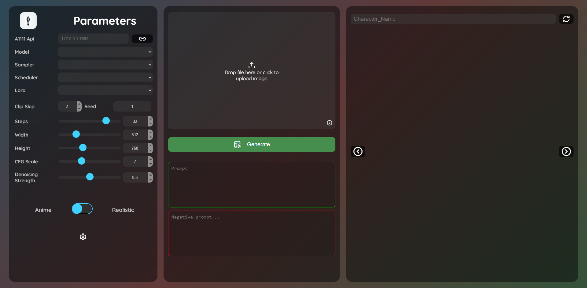
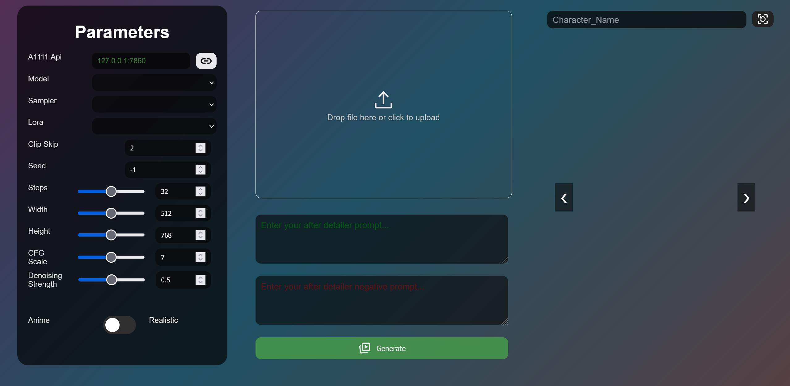

## 2024-11-13
- Docker image available here: [AutoExpress on DockerHub](https://hub.docker.com/r/deepratna/autoexpress)
- Added Logo to UI
- Added Scheduler dropdown
- Added info icon to UI
  - Whenever you hover on the image or the info icon, it will show the raw generation data for convienience.
- Added Settings cog to have a modal for infrequently used settings.
- If element does not exist in dropdown (Model, Sampler, Scheduler, Lora), a new dropdown element is created.

**Avery Contributions**
- Boiler plate Theming Support by modifying [main.css](autoexpress/static/stylesheet/main.css)
- Implemented Gradient pause feature for performace increase.
- Expression jsons are now in different flavours instead of only being Anime/Realistic.
- 

## 2024-11-1
###### -AV
 - Massive Visual UI changes
    - Scaling
    - color flags for future theme creation
    - Re-arranging
    - Changes all icons to lucide-icon-font style
    - Changed all the colors randomly. (Debugging) If anyone likes to make themes, please give me a color scheme.
 - Style System Initial Beginning
    - Removed all things having to do with anime/realistic switch
    - Added drop down that loads everything from styles folder
    - moves style folder to `autoexpress/resources/styles`
    - Added Avery's Illustration Style.
 - UI Functionality
    - When entering a name of a character (The output folder), pressing enter will open the characters folder if it exists without the need to click the refresh button.
    - Style setting send with other settings now, so a backend restart won't confuse the front end
    - Started the foundation fo UI settings, currently one option, Turn Off/On background gradient. (Had poor performance causing a spike in chrome's CPU usage, 0% all the way to 20% for me.)
 - Other Minor fixes and tweaks

## 2024-09-26
- Tested on Ububtu (22.04.3 | jammy)

## 2024-06-23
- Added revamped UI

- Removed my custom logger and added loguru library.

